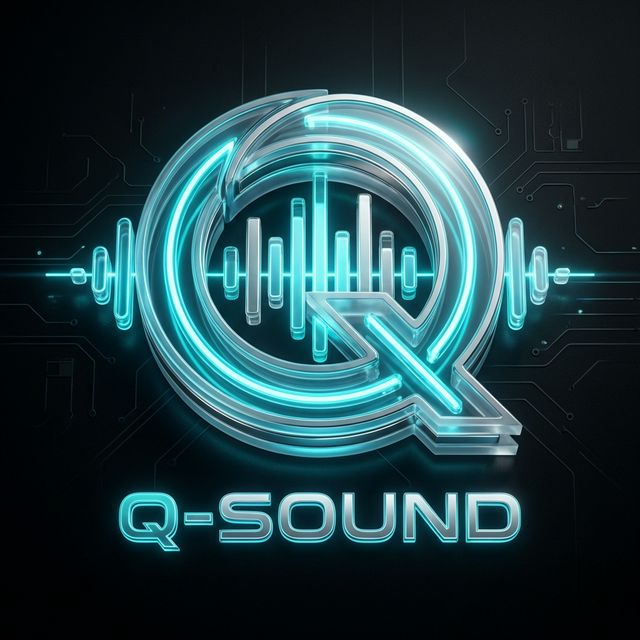

# Q-Sound: Premium Web-Based Soundboard

Q-Sound is a modern, high-performance soundboard application built with a high-end web interface and a robust Python audio engine. It features a professional "Gaming-Pro" aesthetic with glassmorphism, smooth animations, and advanced audio routing capabilities.



## 🚀 Features

- **Modern Web UI**: A stunning interface built with HTML5, Vanilla CSS (Glassmorphism), and Vanilla JS.
- **FastAPI Backend**: High-performance Python backend managing the audio engine and scraper.
- **Audio Routing**: Route audio simultaneously to your physical speakers and a virtual audio cable (for Discord, WhatsApp, etc.).
- **Mic Passthrough**: Built-in microphone passthrough to easily talk through your virtual cable with echo protection.
- **Global Volume Control**: Adjust the overall volume of all sounds in real-time.
- **Favorites System**: Bookmark your favorite sounds with persistent storage.
- **Infinite Search**: Discover thousands of sounds via the integrated MyInstants scraper.
- **Standalone EXE**: Bundled as a standalone Windows executable for easy distribution.

## 🛠️ Tech Stack

- **Frontend**: Vanilla JS, CSS3 (Cam-style), Lucide Icons, Google Fonts (Outfit).
- **Backend**: Python 3.13, FastAPI, Uvicorn.
- **Audio**: Sounddevice, Pygame.Mixer, Numpy.
- **Bundling**: PyInstaller, Pywebview.

## 📦 Installation & Usage

### 1. Requirements
- Python 3.13+
- Virtual Audio Cable (like VB-CABLE) for routing to other apps.

### 2. Setup
```bash
# Clone the repository
git clone https://github.com/QngChan/Q-Sound.git
cd Q-Sound

# Install dependencies
pip install -r requirements.txt
```

### 3. Run
```bash
python main_web.py
```

## 📄 License
This project is open-source and available under the [MIT License](LICENSE).
